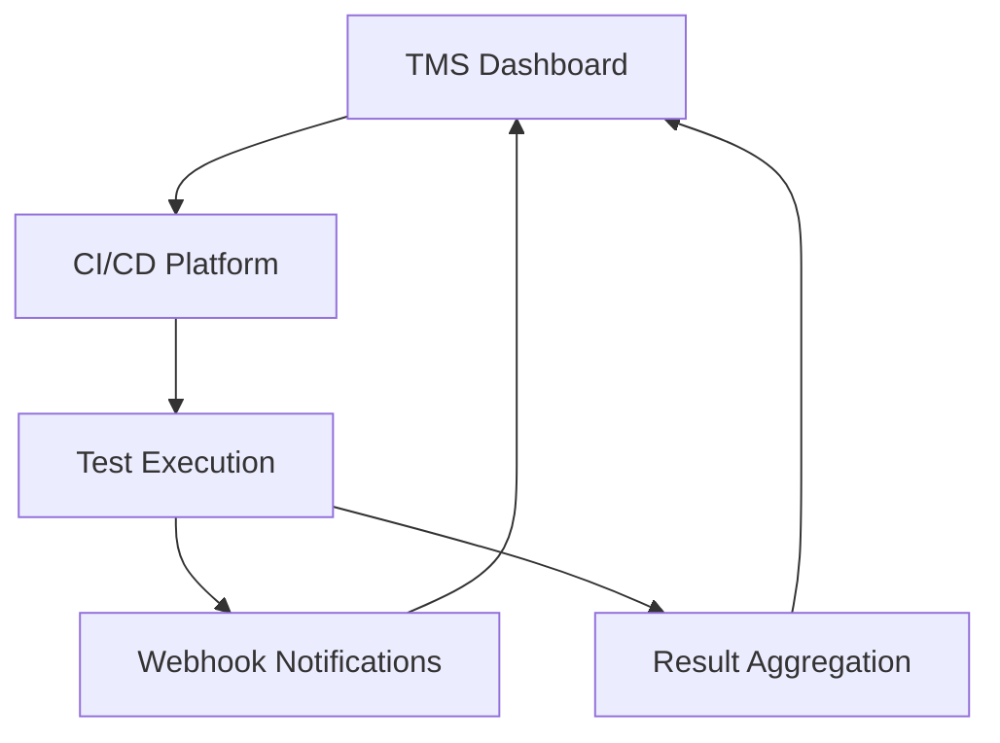

# TMS CI/CD Integration Templates

A comprehensive collection of CI/CD templates for integrating with the Test Management System (TMS) using the Observer/Orchestrator pattern. These templates enable seamless test execution across multiple platforms with real-time reporting and monitoring.

## 🎯 Overview

The TMS CI/CD templates provide production-ready integrations for:

- **GitHub Actions** - Workflows for automated testing with matrix strategies
- **Azure DevOps** - Multi-stage pipelines with comprehensive reporting
- **GitLab CI** - Parallel execution with webhook integration
- **Jenkins** - Declarative pipelines with matrix support
- **Docker** - Containerized test runners with orchestration

All templates follow the Observer/Orchestrator architecture pattern, providing:
- ✅ Real-time webhook notifications
- ✅ Parallel test execution with sharding
- ✅ Comprehensive result aggregation
- ✅ Security best practices
- ✅ Cross-platform compatibility

## 📁 Repository Structure

```
ci-cd-templates/
├── github-actions/          # GitHub Actions workflows
│   ├── test-execution.yml   # Main test execution workflow
│   ├── matrix-test-execution.yml  # Matrix testing workflow
│   └── README.md           # GitHub Actions documentation
├── azure-devops/           # Azure DevOps pipelines
│   ├── azure-pipelines-test.yml    # Standard pipeline
│   ├── multi-stage-test-pipeline.yml  # Multi-stage pipeline
│   └── README.md           # Azure DevOps documentation
├── gitlab/                  # GitLab CI configurations
│   ├── .gitlab-ci.yml      # Main CI configuration
│   └── README.md           # GitLab CI documentation
├── jenkins/                 # Jenkins pipeline files
│   ├── Jenkinsfile         # Standard pipeline
│   ├── matrix-pipeline.jenkinsfile  # Matrix pipeline
│   └── README.md           # Jenkins documentation
├── docker/                  # Docker containers and orchestration
│   ├── Dockerfile.playwright  # Playwright test container
│   ├── Dockerfile.node     # Node.js test container
│   ├── docker-compose.yml  # Container orchestration
│   ├── scripts/            # Test execution scripts
│   └── README.md           # Docker documentation
├── api-docs/               # API integration documentation
│   ├── TMS-Integration-API.md      # Comprehensive API docs
│   └── webhook-examples.md # Webhook integration examples
├── validation/             # Template validation tools
│   ├── validate-templates.js      # JavaScript validator
│   ├── test-templates.sh   # Shell test runner
│   └── package.json        # Validation dependencies
└── README.md              # This file
```

## 🚀 Quick Start

### 1. Choose Your Platform

Select the appropriate template directory for your CI/CD platform:

- **GitHub Actions**: `github-actions/`
- **Azure DevOps**: `azure-devops/`
- **GitLab CI**: `gitlab/`
- **Jenkins**: `jenkins/`
- **Docker**: `docker/`

### 2. Configure Environment Variables

All templates require these environment variables:

```bash
# Required for TMS integration
EXECUTION_ID=your-execution-id
WEBHOOK_URL=https://your-tms-instance.com/api/webhooks/test-results
TMS_WEBHOOK_TOKEN=your-webhook-token

# Optional configuration
TEST_SUITE=smoke|regression|api|ui|all
TEST_ENVIRONMENT=dev|staging|production
TOTAL_SHARDS=4
```

### 3. Deploy Template

Copy the appropriate template to your repository and customize as needed. See platform-specific README files for detailed instructions.

## 🔧 Platform-Specific Setup

### GitHub Actions
```yaml
# Copy github-actions/test-execution.yml to .github/workflows/
# Configure secrets in repository settings:
- TMS_WEBHOOK_TOKEN
- TMS_WEBHOOK_URL
```

### Azure DevOps
```yaml
# Import azure-devops/azure-pipelines-test.yml
# Configure pipeline variables:
- TMS_WEBHOOK_TOKEN (secret)
- webhookUrl
```

### GitLab CI
```yaml
# Copy gitlab/.gitlab-ci.yml to repository root
# Configure CI/CD variables:
- TMS_WEBHOOK_TOKEN (masked)
- WEBHOOK_URL
```

### Jenkins
```groovy
// Import jenkins/Jenkinsfile
// Configure credentials:
- tms-webhook-token (secret text)
// Configure global properties for webhook URL
```

### Docker
```bash
# Use docker/docker-compose.yml
# Set environment variables in .env file
docker-compose --profile sharded up
```

## 📊 Features

### Core Capabilities

| Feature | GitHub Actions | Azure DevOps | GitLab CI | Jenkins | Docker |
|---------|----------------|---------------|-----------|---------|--------|
| Parallel Execution | ✅ | ✅ | ✅ | ✅ | ✅ |
| Matrix Testing | ✅ | ✅ | ❌ | ✅ | ✅ |
| Webhook Integration | ✅ | ✅ | ✅ | ✅ | ✅ |
| Result Aggregation | ✅ | ✅ | ✅ | ✅ | ✅ |
| Artifact Management | ✅ | ✅ | ✅ | ✅ | ✅ |
| Security Scanning | ✅ | ✅ | ❌ | ❌ | ❌ |

### Advanced Features

- **Real-time Progress Updates**: Webhook notifications at each execution stage
- **Cross-browser Testing**: Support for Chromium, Firefox, and WebKit
- **Environment Management**: Configurable test environments (dev/staging/prod)
- **Failure Analysis**: Detailed failed test reporting with screenshots
- **Performance Monitoring**: Execution time tracking and optimization
- **Scalable Architecture**: Horizontal scaling with shard-based parallelization

## 🔐 Security Best Practices

### Secret Management
- ✅ Use platform-specific secret management (GitHub Secrets, Azure Key Vault, etc.)
- ✅ Never commit tokens or credentials to repositories
- ✅ Rotate webhook tokens regularly
- ✅ Use minimal required permissions

### Network Security
- ✅ HTTPS-only webhook endpoints
- ✅ Webhook signature verification
- ✅ IP allowlisting where possible
- ✅ Container network isolation

### Access Control
- ✅ Role-based access to CI/CD systems
- ✅ Audit logging for all executions
- ✅ Separate environments for different teams
- ✅ Regular access reviews

## 🧪 Testing and Validation

### Automated Validation

Run the validation suite to ensure templates are properly configured:

```bash
# Install validation dependencies
cd validation/
npm install

# Run syntax validation
npm run validate

# Run comprehensive tests
npm run test

# Run specific tests
./test-templates.sh
```

### Manual Testing

1. **Syntax Validation**: Ensure YAML/Groovy syntax is valid
2. **Integration Testing**: Test webhook connectivity and authentication
3. **End-to-End Testing**: Run complete test execution workflows
4. **Performance Testing**: Validate parallel execution and scaling

### Validation Reports

The validation suite generates detailed reports including:
- ✅ Syntax validation results
- ✅ Security best practice checks
- ✅ Integration point verification
- ✅ Performance recommendations

## 📈 Performance Optimization

### Parallel Execution

All templates support parallel execution with configurable shard counts:

```yaml
# Example: 4 parallel shards
TOTAL_SHARDS=4
```

### Caching Strategies

- **Dependency Caching**: npm, pip, Maven dependencies
- **Browser Caching**: Pre-installed browsers in containers
- **Artifact Caching**: Test results and reports
- **Layer Caching**: Docker image layers

### Resource Optimization

- **Container Sizing**: Right-sized containers for workload
- **CPU/Memory Limits**: Configured resource constraints
- **Network Optimization**: Minimized data transfer
- **Storage Optimization**: Efficient artifact management

## 🔄 Integration Patterns

### Observer/Orchestrator Pattern



### Webhook Flow

1. **Execution Started**: Notify TMS of test initiation
2. **Shard Progress**: Real-time updates from parallel workers
3. **Shard Complete**: Individual shard completion notifications
4. **Execution Complete**: Final aggregated results

### Error Handling

- **Retry Logic**: Automatic retry for transient failures
- **Graceful Degradation**: Continue execution on non-critical errors
- **Comprehensive Logging**: Detailed logs for debugging
- **Alert Integration**: Notifications for critical failures

## 📚 Documentation

### Platform Guides

- [GitHub Actions Integration](github-actions/README.md)
- [Azure DevOps Integration](azure-devops/README.md)
- [GitLab CI Integration](gitlab/README.md)
- [Jenkins Integration](jenkins/README.md)
- [Docker Integration](docker/README.md)

### API Documentation

- [TMS Integration API](api-docs/TMS-Integration-API.md)
- [Webhook Examples](api-docs/webhook-examples.md)

### Advanced Topics

- Custom test runner integration
- Multi-cloud deployment strategies
- Performance tuning and scaling
- Monitoring and observability

## 🤝 Contributing

### Development Setup

```bash
# Clone repository
git clone <repository-url>
cd ci-cd-templates

# Install validation tools
cd validation/
npm install

# Run tests
npm test
```

### Template Guidelines

1. **Follow Naming Conventions**: Use consistent file naming
2. **Include Documentation**: Comprehensive README for each platform
3. **Add Validation**: Ensure templates pass validation suite
4. **Security Review**: Follow security best practices
5. **Test Coverage**: Include integration tests

### Submission Process

1. Create feature branch
2. Implement changes with tests
3. Run validation suite
4. Submit pull request with description
5. Address review feedback

## 🔧 Troubleshooting

### Common Issues

#### Authentication Failures
```bash
# Check token configuration
echo $TMS_WEBHOOK_TOKEN
curl -H "Authorization: Bearer $TMS_WEBHOOK_TOKEN" $WEBHOOK_URL
```

#### Network Connectivity
```bash
# Test webhook endpoint
curl -I $WEBHOOK_URL
nslookup your-tms-instance.com
```

#### Template Syntax Errors
```bash
# Validate YAML syntax
python -c "import yaml; yaml.safe_load(open('template.yml'))"

# Validate with tool
cd validation/
npm run validate
```

### Support Channels

- **GitHub Issues**: Bug reports and feature requests
- **Documentation**: Comprehensive guides and examples
- **Community Forum**: Discussion and best practices
- **Support Portal**: Direct technical support

## 📊 Metrics and Monitoring

### Key Metrics

- **Execution Time**: Total and per-shard execution duration
- **Success Rate**: Percentage of successful test runs
- **Failure Analysis**: Root cause analysis of failures
- **Resource Usage**: CPU, memory, and network utilization
- **Webhook Reliability**: Delivery success rate

### Monitoring Integration

- **Prometheus**: Metrics collection and alerting
- **Grafana**: Visualization and dashboards
- **ELK Stack**: Log aggregation and analysis
- **Datadog**: Application performance monitoring

## 🎯 Roadmap

### Current Version (v1.0)
- ✅ Core platform templates
- ✅ Webhook integration
- ✅ Parallel execution
- ✅ Docker containers
- ✅ Validation tools

### Upcoming Features (v1.1)
- 🔄 Kubernetes deployment templates
- 🔄 Advanced monitoring integration
- 🔄 Multi-cloud support
- 🔄 Enhanced security features

### Future Enhancements (v2.0)
- 🔄 AI-powered test optimization
- 🔄 Visual test reporting
- 🔄 Advanced analytics
- 🔄 Self-healing pipelines

## 📄 License

This project is licensed under the MIT License - see the [LICENSE](LICENSE) file for details.

## 📞 Support

For questions, issues, or contributions:

- **Email**: support@tms.com
- **GitHub**: [tms/ci-cd-templates](https://github.com/tms/ci-cd-templates)
- **Documentation**: [docs.tms.com](https://docs.tms.com)
- **Community**: [community.tms.com](https://community.tms.com)

---

**Made with ❤️ by the TMS Team**